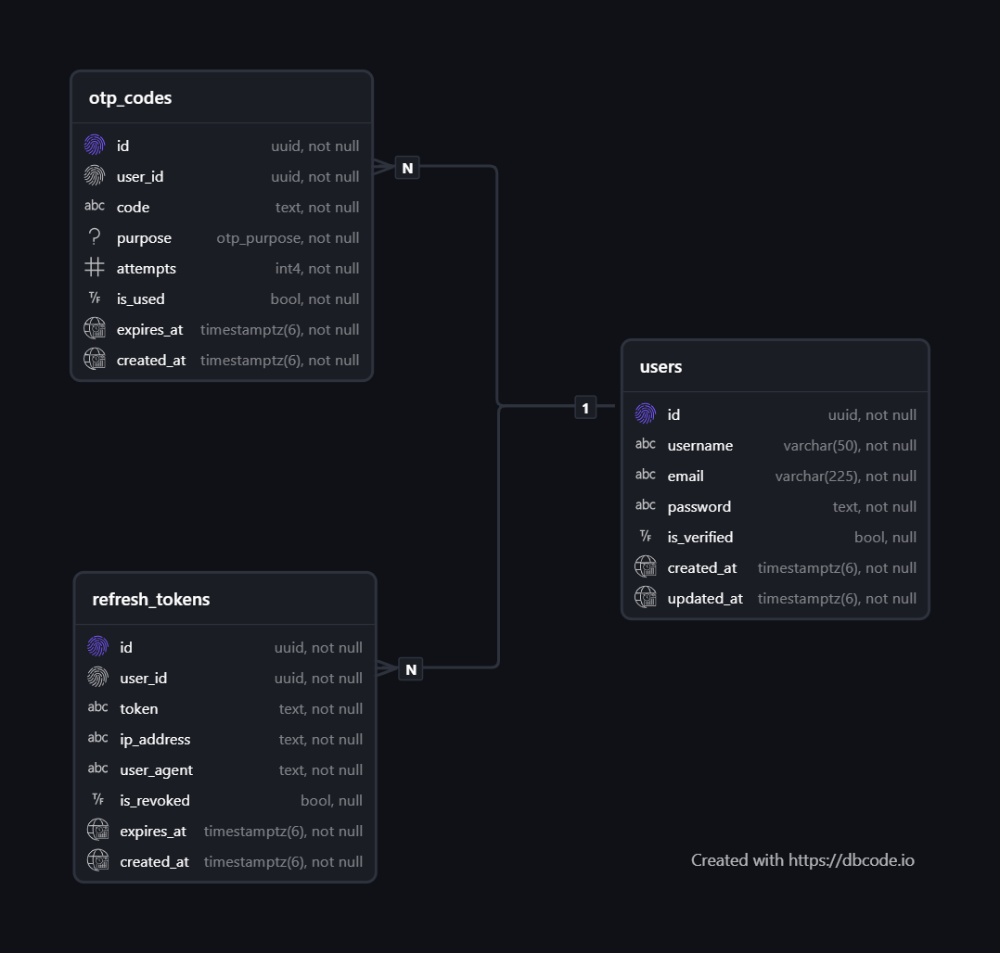

# Warden

An authentication API built with Node.js and PostgreSQL.

**Base URL:** `https://warden-seven-nu.vercel.app`

---

## Stack

- **Runtime:** Node.js
- **Framework:** Express.js
- **Database:** PostgreSQL (Neon)
- **Hosting:** Vercel

---

## Features

- Register with email OTP verification
- Login with JWT (httpOnly cookies)
- Refresh token rotation
- Forgot & reset password via OTP
- Account deletion with password confirmation
- Rate limiting & input validation

---

## Endpoints

| Method | Endpoint           | Auth | Description             |
| ------ | ------------------ | ---- | ----------------------- |
| POST   | `/register`        | No   | Create account          |
| POST   | `/login`           | No   | Login                   |
| POST   | `/verify-email`    | No   | Verify email with OTP   |
| POST   | `/resend-otp`      | No   | Resend OTP              |
| POST   | `/forgot-password` | No   | Request password reset  |
| POST   | `/reset-password`  | No   | Reset password with OTP |
| POST   | `/logout`          | Yes  | Logout                  |
| POST   | `/refresh-token`   | No   | Refresh access token    |
| DELETE | `/delete-account`  | Yes  | Delete account          |

---

## Setup

```bash
git clone https://github.com/yourusername/warden.git
cd warden
npm install
cp .env.example .env
node src/config/migrate.js
npm run dev
```

## Environment Variables

```bash
PORT=5000
NODE_ENV=development
CLIENT_URL=http://localhost:3000
DATABASE_URL=
JWT_ACCESS_SECRET=
JWT_ACCESS_EXPIRES_IN=15m
JWT_REFRESH_SECRET=
JWT_REFRESH_EXPIRES_IN=7d
BREVO_API_KEY=
SENDER_EMAIL=
```

---

## Database Schema


